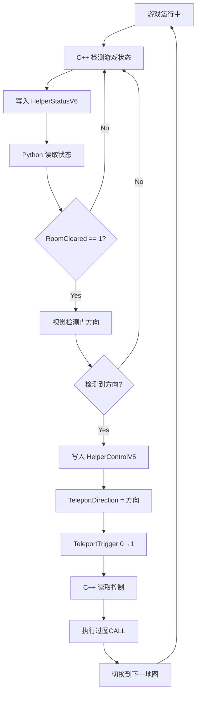

# AradVision 与 game-all 协作接口协议规范

## 📋 文档信息

| 属性 | 值 |
|------|------|
| **协议名称** | HelperStatus V6 + HelperControl V5 |
| **版本号** | V1.0 |
| **日期** | 2025-02-27 |
| **状态** | 草案 |
| **维护方** | AradVision 项目组 |
| **协作方** | game-all 项目组 |

---

## 🎯 协议概述

### 设计目标

本协议定义 **AradVision（Python Bot）** 与 **game-all（C++ 辅助工具）** 之间的数据交换规范，实现：

1. **游戏状态共享**：C++ → Python（房间清空、门开启、怪物数量）
2. **过图控制**：Python → C++（触发过图CALL，参数：上/下/左/右）

### 通信架构

```
┌─────────────────────────────────────────────────────────────┐
│                      Windows 共享内存                        │
├─────────────────────────────────────────────────────────────┤
│                                                               │
│  ┌─────────────────────┐         ┌─────────────────────┐    │
│  │ game-all (C++)      │         │ AradVision (Python) │    │
│  │                     │         │                     │    │
│  │ game-payload.dll    │         │ core/cpp_bridge.py  │    │
│  │                     │         │                     │    │
│  └──────────┬──────────┘         └──────────┬──────────┘    │
│             │                                │               │
│             │ 写入状态                       │ 读取状态       │
│             ▼                                ▲               │
│  ┌─────────────────────┐                   │               │
│  │ HelperStatusV6      │                   │               │
│  │ (168 bytes)         │───────────────────┘               │
│  │                     │                                   │
│  │ - RoomCleared       │                                   │
│  │ - DoorOpen          │                                   │
│  │ - MonsterCount      │                                   │
│  │ - MapTeleportReady  │                                   │
│  └─────────────────────┘                                   │
│             ▲                                                │
│             │ 读取控制                                       │
│             │                                                │
│  ┌─────────────────────┐                   │               │
│  │ HelperControlV5     │                   │               │
│  │ (60 bytes)          │                   │               │
│  │                     │                   │               │
│  │ - TeleportDirection │                   │               │
│  │ - TeleportTrigger   │                   │               │
│  └─────────────────────┘                   │               │
│             │                                │               │
│             │ 写入控制                       │                │
│             ▼                                │               │
│  ┌─────────────────────┐         ┌─────────────────────┐    │
│  │ C++ 执行过图CALL     │         │ Python 检测门方向    │    │
│  │ (上/下/左/右)        │         │ (视觉识别)           │    │
│  └─────────────────────┘         └─────────────────────┘    │
│                                                               │
└─────────────────────────────────────────────────────────────┘
```

### 技术约束

| 属性 | 值 | 说明 |
|------|------|------|
| **平台** | Windows x86 | 32位系统 |
| **通信方式** | 命名共享内存 | Named Shared Memory |
| **字节序** | 小端序 | Little-Endian |
| **内存对齐** | Pack = 1 | 禁止自动对齐 |
| **命名空间** | `Local\` 优先 | 同一会话进程通信 |

---

## 📦 协议定义

### 通道一：HelperStatusV6（状态通道）

**用途**：game-all → AradVision，报告游戏状态

#### 命名规则

```
Local\GameHelperStatus_{pid}
Global\GameHelperStatus_{pid}
```

- **优先级**：Local 优先，Global 兜底
- **占位符**：`{pid}` 为目标游戏进程 ID

#### 结构体定义

**C++ 版本**：

```cpp
#pragma pack(push, 1)
struct HelperStatusV6 {
    // ========== V5 原有字段（0-151 字节）==========
    uint32_t Version;                    // = 6
    uint32_t Size;                       // = 168
    uint64_t LastTickMs;                 // 心跳时间戳（毫秒）
    uint32_t Pid;                        // 目标进程 PID
    int32_t ProcessAlive;                // 进程存活标记（0/1）
    int32_t AutoTransparentEnabled;      // 自动透明开关
    int32_t FullscreenAttackTarget;      // 全屏攻击目标开关
    int32_t FullscreenAttackPatchOn;     // 全屏攻击补丁状态
    int32_t AttractMode;                 // 吸怪模式
    int32_t AttractPositive;             // 吸怪方向
    int32_t GatherItemsEnabled;          // 聚物开关
    int32_t DamageEnabled;               // 动态倍攻开关
    int32_t DamageMultiplier;            // 动态倍攻倍率（1~1000）
    int32_t InvincibleEnabled;           // 怪物零伤开关
    int32_t SummonEnabled;               // 召唤开关
    uint64_t SummonLastTick;             // 召唤最后触发时间
    int32_t FullscreenSkillEnabled;      // 全屏技能开关
    int32_t FullscreenSkillActive;       // 全屏技能激活状态
    uint32_t FullscreenSkillHotkey;      // 全屏技能热键
    int32_t HotkeyEnabled;               // 热键总开关
    wchar_t PlayerName[32];              // 玩家名（UTF-16）

    // ========== V6 新增字段（152-167 字节）==========
    int32_t RoomCleared;                 // 【AradVision】房间是否已清空
    int32_t DoorOpen;                    // 【AradVision】门是否已开启
    int32_t MonsterCount;                // 【AradVision】当前房间怪物数量
    int32_t MapTeleportReady;            // 【AradVision】过图CALL是否就绪
};
#pragma pack(pop)
```

**C++ 校验基线（static_assert）**：

```cpp
#include <cstddef>

static_assert(sizeof(HelperStatusV6) == 168, "HelperStatusV6 size mismatch");
static_assert(offsetof(HelperStatusV6, PlayerName) == 88, "HelperStatusV6.PlayerName offset mismatch");
static_assert(offsetof(HelperStatusV6, RoomCleared) == 152, "HelperStatusV6.RoomCleared offset mismatch");
static_assert(offsetof(HelperStatusV6, DoorOpen) == 156, "HelperStatusV6.DoorOpen offset mismatch");
static_assert(offsetof(HelperStatusV6, MonsterCount) == 160, "HelperStatusV6.MonsterCount offset mismatch");
static_assert(offsetof(HelperStatusV6, MapTeleportReady) == 164, "HelperStatusV6.MapTeleportReady offset mismatch");
```

**Python 版本**：

```python
import ctypes

class HelperStatusV6(ctypes.Structure):
    _pack_ = 1  # 禁止对齐

    _fields_ = [
        # V5 原有字段
        ("Version", ctypes.c_uint32),
        ("Size", ctypes.c_uint32),
        ("LastTickMs", ctypes.c_uint64),
        ("Pid", ctypes.c_uint32),
        ("ProcessAlive", ctypes.c_int32),
        ("AutoTransparentEnabled", ctypes.c_int32),
        ("FullscreenAttackTarget", ctypes.c_int32),
        ("FullscreenAttackPatchOn", ctypes.c_int32),
        ("AttractMode", ctypes.c_int32),
        ("AttractPositive", ctypes.c_int32),
        ("GatherItemsEnabled", ctypes.c_int32),
        ("DamageEnabled", ctypes.c_int32),
        ("DamageMultiplier", ctypes.c_int32),
        ("InvincibleEnabled", ctypes.c_int32),
        ("SummonEnabled", ctypes.c_int32),
        ("SummonLastTick", ctypes.c_uint64),
        ("FullscreenSkillEnabled", ctypes.c_int32),
        ("FullscreenSkillActive", ctypes.c_int32),
        ("FullscreenSkillHotkey", ctypes.c_uint32),
        ("HotkeyEnabled", ctypes.c_int32),
        ("PlayerName", ctypes.c_wchar * 32),

        # V6 新增字段
        ("RoomCleared", ctypes.c_int32),
        ("DoorOpen", ctypes.c_int32),
        ("MonsterCount", ctypes.c_int32),
        ("MapTeleportReady", ctypes.c_int32),
    ]
```

#### 字段说明

| 字段 | 类型 | 偏移量 | 说明 | 有效值 | 用途 |
|------|------|--------|------|--------|------|
| **Version** | uint32 | 0 | 协议版本号 | **6** | 协议校验 |
| **Size** | uint32 | 4 | 结构体大小 | **168** | 协议校验 |
| **LastTickMs** | uint64 | 8 | 心跳时间戳 | 毫秒 | 存活检测 |
| **RoomCleared** | int32 | **152** | **房间清空状态** | 0/1 | Bot决策 |
| **DoorOpen** | int32 | **156** | **门开启状态** | 0/1 | 过图条件 |
| **MonsterCount** | int32 | **160** | **怪物数量** | 0~N | 辅助判断 |
| **MapTeleportReady** | int32 | **164** | **过图CALL就绪** | 0/1 | 防误触发 |

**字段语义**：

- `RoomCleared = 1`：当前房间所有怪物已清除，可以进入下一地图
- `DoorOpen = 1`：下一地图的门已开启（DNF中怪物全清后门才会开）
- `MonsterCount`：当前房间存活的怪物数量（辅助验证）
- `MapTeleportReady = 1`：C++过图CALL模块已就绪，可以接受控制指令

#### 内存布局

```
偏移量    字段名                    大小
----------------------------------------------------
0x00     Version                  4 bytes
0x04     Size                     4 bytes
0x08     LastTickMs               8 bytes
0x10     Pid                      4 bytes
0x14     ProcessAlive             4 bytes
...      (V5 原有字段省略)         ...
0x58     PlayerName[32]           64 bytes (wchar_t)
0x98     RoomCleared              4 bytes  ⬅ AradVision 使用
0x9C     DoorOpen                 4 bytes  ⬅ AradVision 使用
0xA0     MonsterCount             4 bytes  ⬅ AradVision 使用
0xA4     MapTeleportReady         4 bytes  ⬅ AradVision 使用
----------------------------------------------------
Total                             168 bytes (0xA8)
```

---

### 通道二：HelperControlV5（控制通道）

**用途**：AradVision → game-all，触发过图CALL

#### 命名规则

```
Local\GameHelperControl_{pid}
Global\GameHelperControl_{pid}
```

#### 结构体定义

**C++ 版本**：

```cpp
#pragma pack(push, 1)
struct HelperControlV5 {
    // ========== V4 原有字段（0-55 字节）==========
    uint32_t Version;                    // = 5
    uint32_t Size;                       // = 60
    uint32_t Pid;                        // 目标进程 PID
    uint32_t LastUpdateTick;             // 最近更新时间（TickCount）
    uint8_t FullscreenAttack;            // 全屏攻击覆盖模式
    uint8_t FullscreenSkill;             // 全屏技能覆盖模式
    uint8_t AutoTransparent;             // 自动透明覆盖模式
    uint8_t Attract;                     // 吸怪覆盖模式
    uint8_t HotkeyEnabled;               // 热键覆盖模式
    uint8_t Reserved0;                   // 保留（与 V4 对齐）
    uint8_t Reserved1;                   // 保留（与 V4 对齐）
    uint8_t Reserved2;                   // 保留（与 V4 对齐）
    uint32_t SummonSequence;             // 召唤序列号
    uint32_t ActionSequence;             // 动作序列号
    uint32_t ActionMask;                 // 动作掩码
    uint8_t DesiredFullscreenAttack;     // 目标：全屏攻击开关
    uint8_t DesiredFullscreenSkill;      // 目标：全屏技能激活
    uint8_t DesiredAutoTransparent;      // 目标：自动透明开关
    uint8_t DesiredAttractEnabled;       // 目标：吸怪开关
    uint8_t DesiredAttractMode;          // 目标：吸怪档位（1~4）
    uint8_t DesiredAttractPositive;      // 目标：吸怪方向（1=正向，0=负向）
    uint8_t DesiredHotkeyEnabled;        // 目标：热键总开关
    uint8_t DesiredGatherItemsEnabled;   // 目标：聚物开关
    uint32_t DesiredDamageMultiplier;    // 目标：动态倍攻倍率
    uint8_t DesiredDamageEnabled;        // 目标：动态倍攻开关
    uint8_t DesiredInvincibleEnabled;    // 目标：怪物零伤开关
    uint8_t Reserved3;                   // 保留（与 V4 对齐）
    uint8_t Reserved4;                   // 保留（与 V4 对齐）
    uint8_t Reserved5;                   // 保留（与 V4 对齐）
    uint8_t Reserved6;                   // 保留（与 V4 对齐）
    uint8_t Reserved7;                   // 保留（与 V4 对齐）
    uint8_t Reserved8;                   // 保留（与 V4 对齐）

    // ========== V5 新增字段（56-59 字节）==========
    uint8_t TeleportDirection;           // 【AradVision】过图方向
    uint8_t TeleportTrigger;             // 【AradVision】触发标志
    uint8_t TeleportReserved0;           // 预留扩展
    uint8_t TeleportReserved1;           // 预留扩展
};
#pragma pack(pop)
```

**C++ 校验基线（static_assert）**：

```cpp
#include <cstddef>

static_assert(sizeof(HelperControlV5) == 60, "HelperControlV5 size mismatch");
static_assert(offsetof(HelperControlV5, SummonSequence) == 24, "HelperControlV5.SummonSequence offset mismatch");
static_assert(offsetof(HelperControlV5, DesiredDamageMultiplier) == 44, "HelperControlV5.DesiredDamageMultiplier offset mismatch");
static_assert(offsetof(HelperControlV5, TeleportDirection) == 56, "HelperControlV5.TeleportDirection offset mismatch");
static_assert(offsetof(HelperControlV5, TeleportTrigger) == 57, "HelperControlV5.TeleportTrigger offset mismatch");
```

**Python 版本**：

```python
class HelperControlV5(ctypes.Structure):
    _pack_ = 1

    _fields_ = [
        # V4 原有字段
        ("Version", ctypes.c_uint32),
        ("Size", ctypes.c_uint32),
        ("Pid", ctypes.c_uint32),
        ("LastUpdateTick", ctypes.c_uint32),
        ("FullscreenAttack", ctypes.c_uint8),
        ("FullscreenSkill", ctypes.c_uint8),
        ("AutoTransparent", ctypes.c_uint8),
        ("Attract", ctypes.c_uint8),
        ("HotkeyEnabled", ctypes.c_uint8),
        ("Reserved0", ctypes.c_uint8),
        ("Reserved1", ctypes.c_uint8),
        ("Reserved2", ctypes.c_uint8),
        ("SummonSequence", ctypes.c_uint32),
        ("ActionSequence", ctypes.c_uint32),
        ("ActionMask", ctypes.c_uint32),
        ("DesiredFullscreenAttack", ctypes.c_uint8),
        ("DesiredFullscreenSkill", ctypes.c_uint8),
        ("DesiredAutoTransparent", ctypes.c_uint8),
        ("DesiredAttractEnabled", ctypes.c_uint8),
        ("DesiredAttractMode", ctypes.c_uint8),
        ("DesiredAttractPositive", ctypes.c_uint8),
        ("DesiredHotkeyEnabled", ctypes.c_uint8),
        ("DesiredGatherItemsEnabled", ctypes.c_uint8),
        ("DesiredDamageMultiplier", ctypes.c_uint32),
        ("DesiredDamageEnabled", ctypes.c_uint8),
        ("DesiredInvincibleEnabled", ctypes.c_uint8),
        ("Reserved3", ctypes.c_uint8),
        ("Reserved4", ctypes.c_uint8),
        ("Reserved5", ctypes.c_uint8),
        ("Reserved6", ctypes.c_uint8),
        ("Reserved7", ctypes.c_uint8),
        ("Reserved8", ctypes.c_uint8),

        # V5 新增字段
        ("TeleportDirection", ctypes.c_uint8),
        ("TeleportTrigger", ctypes.c_uint8),
        ("TeleportReserved0", ctypes.c_uint8),
        ("TeleportReserved1", ctypes.c_uint8),
    ]
```

#### 过图方向枚举

```cpp
enum TeleportDirection : uint8_t {
    NONE = 0,  // 无操作
    UP = 1,    // 上方地图
    DOWN = 2,  // 下方地图
    LEFT = 3,  // 左侧地图
    RIGHT = 4  // 右侧地图
};
```

```python
class TeleportDirection(IntEnum):
    NONE = 0
    UP = 1
    DOWN = 2
    LEFT = 3
    RIGHT = 4
```

#### 字段说明

| 字段 | 类型 | 偏移量 | 说明 | 有效值 |
|------|------|--------|------|--------|
| **Version** | uint32 | 0 | 协议版本号 | **5** |
| **Size** | uint32 | 4 | 结构体大小 | **60** |
| **TeleportDirection** | uint8 | **56** | **过图方向** | 0~4 |
| **TeleportTrigger** | uint8 | **57** | **触发标志** | 0/1 |

**触发机制（边沿触发）**：

```cpp
// C++ 侧检测逻辑
uint8_t lastTrigger = control->TeleportTrigger;
// 读取新状态...
if (control->TeleportTrigger != lastTrigger && control->TeleportTrigger == 1) {
    // 触发一次过图CALL
    switch (control->TeleportDirection) {
        case TeleportDirection::UP:    TeleportUp(); break;
        case TeleportDirection::DOWN:  TeleportDown(); break;
        case TeleportDirection::LEFT:  TeleportLeft(); break;
        case TeleportDirection::RIGHT: TeleportRight(); break;
    }
}
```

#### 内存布局

```
偏移量    字段名                    大小
----------------------------------------------------
...      (V4 原有字段省略)         ...
0x38     ┌─ V4 结束 ──────────────┴─ 56 bytes
0x38     │
0x38     ├─ TeleportDirection      1 byte   ⬅ AradVision 使用
0x39     │  TeleportTrigger        1 byte   ⬅ AradVision 使用
0x3A     │  TeleportReserved0      1 byte
0x3B     └─ TeleportReserved1      1 byte
----------------------------------------------------
Total                             60 bytes (0x3C)
```

---

## 🔄 协作流程

### 完整工作流程



### 时序图

```
时间轴  C++ (game-all)           共享内存              Python (AradVision)
────────────────────────────────────────────────────────────────────────
  t0    检测到房间清空          Status.RoomCleared = 1
  t1    检测到门已开启          Status.DoorOpen = 1
  t2    写入状态完成
                                ─────────────────────→  读取状态
  t3                                                  room_cleared = True
  t4                                                  视觉检测门方向
  t5                                                  direction = RIGHT
                                                      写入控制
                                ←─────────────────────  Control.Direction = 4
                                                      Control.Trigger = 1
  t6    读取控制
  t7    检测到 Trigger 边沿
  t8    执行 TeleportRight()
  t9    切换地图完成
                                Status.RoomCleared = 0
```

---

## 💻 Python API 使用示例

### 基础使用

```python
from core.cpp_bridge import CppBridge, TeleportDirection
import win32gui
import win32process

# 1. 获取游戏进程 PID
hwnd = win32gui.FindWindow(None, "地下城与勇士")
_, pid = win32process.GetWindowThreadProcessId(hwnd)

# 2. 创建桥接器
bridge = CppBridge(pid)

# 3. 读取游戏状态
state = bridge.read_state()
if state:
    print(f"房间清空: {state['room_cleared']}")
    print(f"门已开启: {state['door_open']}")
    print(f"怪物数量: {state['monster_count']}")

    # 4. 判断是否需要过图
    if state['room_cleared'] and state['door_open']:
        # 5. 检测门方向（视觉识别）
        direction = detect_door_direction()  # 返回 TeleportDirection.RIGHT

        # 6. 触发过图CALL
        success = bridge.teleport(direction)
        if success:
            print("✓ 过图成功，等待新地图加载...")

# 7. 关闭桥接器
bridge.close()
```

### Bot FSM 集成

```python
class BotFSM:
    def __init__(self, game_pid: int):
        self.cpp = CppBridge(game_pid)

    def update(self, ctx: GameContext) -> ActionCommand:
        # 读取 C++ 状态
        state = self.cpp.read_state()

        if state and state["room_cleared"]:
            # 房间已清空，检测门方向
            direction = self._detect_door_direction(ctx.frame)

            if direction != TeleportDirection.NONE:
                # 触发过图
                self.cpp.teleport(direction)
                return ActionCommand.WAIT

        # 正常战斗逻辑
        return self._combat_logic(ctx)
```

---

## ⚠️ 错误处理

### 协议版本不匹配

| 症状 | 原因 | 处理方式 |
|------|------|----------|
| `Version != 6` | C++ 使用旧协议 | 记录警告日志，返回 None |
| `Size != 168` | 结构体定义错误 | 记录警告日志，返回 None |

**Python 处理示例**：

```python
struct = HelperStatusV6.from_buffer_copy(buffer)
if struct.Version != 6 or struct.Size != 168:
    logger.warning(f"协议不匹配: V{struct.Version}, Size={struct.Size}")
    return None  # 降级到纯视觉模式
```

### 共享内存不存在

| 症状 | 原因 | 处理方式 |
|------|------|----------|
| `OpenFileMappingW` 失败 | C++ 未注入或进程不存在 | 抛出异常，切换到纯视觉模式 |

**Python 处理示例**：

```python
try:
    handle = win32file.OpenFileMappingW(...)
except win32file.error:
    logger.error("无法打开共享内存，C++ 可能未注入")
    raise CppBridgeUnavailable  # 切换到纯视觉模式
```

### 心跳超时

| 症状 | 原因 | 处理方式 |
|------|------|----------|
| `LastTickMs` 超过 3 秒 | C++ 进程崩溃/挂起 | 标记状态无效，停止使用 |

**Python 处理示例**：

```python
import time

current_ms = int(time.time() * 1000)
if current_ms - state["timestamp_ms"] > 3000:
    logger.warning("C++ 心跳超时，状态可能失效")
    return None
```

---

## 📊 性能指标

| 指标 | 目标值 | 说明 |
|------|--------|------|
| **状态读取延迟** | <0.1ms | 共享内存直接读取 |
| **控制写入延迟** | <0.1ms | 共享内存直接写入 |
| **过图CALL执行时间** | <100ms | 取决于游戏加载速度 |
| **协议内存占用** | 228 bytes | Status(168) + Control(60) |

---

## 📚 依赖关系

### Python 依赖

```bash
# 必需
pip install pywin32

# 可选（用于日志）
pip install loguru
```

### C++ 依赖

- Windows SDK（共享内存 API）
- C++11 或更高版本
- 与原有 V5/V4 协议兼容

---

## 🔧 调试工具

### Process Explorer

**验证共享内存是否存在**：

1. 打开 Process Explorer
2. 查找目标进程（游戏进程）
3. 查看 `Handles` → 搜索 `GameHelperStatus`
4. 确认 `Size` 是否为 168

### Python 调试脚本

```python
# debug_cpp_bridge.py
from core.cpp_bridge import CppBridge

pid = 1234  # 替换为实际 PID

with CppBridge(pid) as bridge:
    # 打印原始数据
    import ctypes
    struct = HelperStatusV6.from_buffer_copy(bridge.status_buffer)
    print(f"Version: {struct.Version}")
    print(f"RoomCleared: {struct.RoomCleared}")
    print(f"DoorOpen: {struct.DoorOpen}")
    print(f"MonsterCount: {struct.MonsterCount}")
```

---

## 📝 版本历史

| 版本 | 日期 | 变更内容 |
|------|------|----------|
| **V1.0** | 2025-02-27 | 初始版本<br>- 定义 HelperStatusV6（168字节）<br>- 定义 HelperControlV5（60字节）<br>- 新增过图控制能力 |

---

## 🔗 相关文档

- [game-all 项目 README](./C++项目_README.md)
- [AradVision 架构设计](../架构设计.md)
- [Bot FSM 状态机设计](../Bot_FSM设计.md)

---

## 📞 联系方式

如有协议问题，请联系：
- **AradVision 项目组**：GitHub Issues
- **game-all 项目组**：见项目 README

---

**最后更新**：2025-02-27
