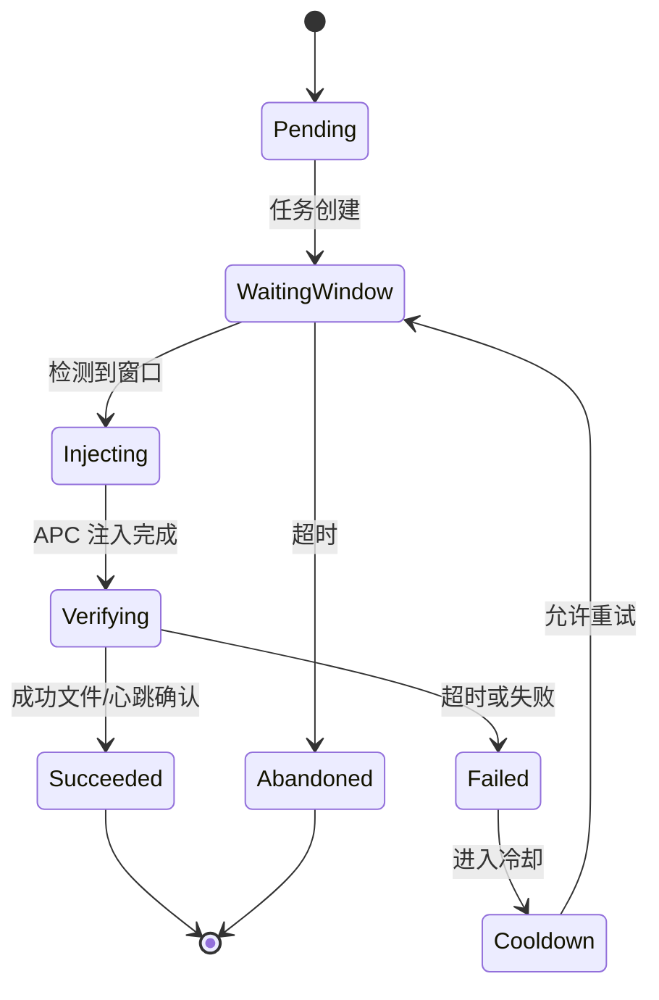

# 代码修改方案—并发注入与窗口重建适配

> 目的：在不修改业务逻辑的前提下，解决“多进程注入卡死/延迟”和“窗口重建导致缓存失效”问题。  
> 范围：仅设计方案与修改点清单，不直接改代码。

---

## 一、目标与约束

### 目标
- **并发注入**：多个目标进程同时启动时，注入器不会因等待单一进程而阻塞其他进程。
- **窗口重建适配**：主窗口被销毁/重建或多窗口切换时，仍能稳定识别当前有效窗口。
- **稳定优先**：Hook 回调不执行任何阻塞性窗口枚举。

### 约束
- 平台：Windows x86
- 注入方式：APC（保持既有策略）
- 状态确认：成功文件为主，共享内存心跳兜底（保持既有机制）

---

## 二、方案概述（方案 A）

1. **注入器改为任务化并发**  
   - 主循环只负责发现 PID 与调度任务，不在主线程等待窗口/注入。
2. **窗口缓存由后台线程维护**  
   - `EnumWindows` 仅运行在后台线程，Hook 回调只读取缓存句柄。
3. **窗口重建适配**  
   - 缓存结构记录 PID、更新时间与窗口有效性，发现窗口失效时自动替换。

---

## 三、具体修改点清单（文件 / 函数级）

### 1) `Injector/main.cpp`

#### 新增/修改的数据结构
- **新增：任务状态枚举**
  - `enum class InjectTaskState { Pending, WaitingWindow, Injecting, Verifying, Succeeded, Failed, Abandoned, Cooldown };`
- **新增：任务上下文**
  - `struct InjectTask { DWORD pid; InjectTaskState state; ULONGLONG last_tick; int attempts; HANDLE thread; ... }`
- **新增：并发控制**
  - `size_t max_concurrent_tasks`（默认建议 2~3）
  - `DWORD window_wait_timeout_ms`（默认建议 30000）
  - `DWORD window_poll_interval_ms`（默认建议 500）
  - `DWORD failure_cooldown_ms`（默认建议 3000~5000）

#### 主要函数修改点
- **`wmain()`**
  - 调度层：维护 `std::unordered_map<DWORD, InjectTask>`  
  - 主循环：仅做 “扫描 PID + 任务创建/回收”
  - 避免在主循环中直接 `WaitForProcessWindow()` 或 `TryInjectProcess()`

- **`TryInjectProcess()`**
  - 保持注入与验证逻辑不变，仅由任务线程调用  
  - 不直接修改主循环结构

- **新增函数**
  - `static bool WaitForProcessWindow(DWORD pid, DWORD timeout_ms, DWORD poll_interval_ms);`
  - `static DWORD WINAPI InjectTaskThread(LPVOID param);`

#### 任务线程逻辑（核心）
1. `state=WaitingWindow` → `WaitForProcessWindow`
2. `state=Injecting` → `TryInjectProcess`
3. `state=Verifying` → 成功文件/心跳确认（已存在）
4. 成功：`Succeeded`，失败：`Failed` → `Cooldown` 或 `Abandoned`

---

### 2) `Payload/modules/sync/SyncMod.cpp`

#### 全局变量调整
- **原**：`static HWND g_selfWindowCache` + `g_selfWindowCacheTick`  
- **改为**：缓存结构（原子读写）  

建议结构（仅设计）：
```cpp
struct SelfWindowCache {
    std::atomic<HWND> hwnd { nullptr };
    std::atomic<DWORD> pid { 0 };
    std::atomic<ULONGLONG> last_update_ms { 0 };
    std::atomic<ULONG> flags { 0 }; // 可选：可见/文本/顶层等标记
};

static SelfWindowCache g_selfWindowCache;
```

#### 函数修改点
- **新增** `UpdateSelfWindowCache()`  
  - 仅在后台线程调用 `EnumWindows`
  - 更新缓存（原子写）
- **修改** `GetSelfMainWindow()`  
  - 不再枚举，仅返回缓存  
  - 轻量校验 `IsWindow()`，失效返回 `nullptr`
- **修改** `WorkerThread()`  
  - 启动后立即调用 `UpdateSelfWindowCache()`  
  - 每 500~1000ms 更新一次  
  - 不影响 Hook 回调逻辑

---

## 四、并发注入任务状态机设计

> 目标：让一个 PID 的等待/注入不会阻塞其他 PID。



### 说明
- `Cooldown` 用于避免快速重试导致系统压力过高。  
- `Abandoned` 用于明确放弃该 PID，避免无限重试。  

---

## 五、窗口缓存结构设计（字段与更新规则）

### 字段建议
| 字段 | 含义 | 说明 |
| --- | --- | --- |
| `HWND hwnd` | 当前缓存句柄 | 原子更新 |
| `DWORD pid` | 进程 ID | 校验归属 |
| `ULONGLONG last_update_ms` | 最近更新时间 | 用于诊断/超时 |
| `ULONG flags` | 轻量标记 | 例如可见/有标题/顶层 |

### 更新规则
1. 后台线程执行 `EnumWindows`  
2. 过滤条件：  
   - `GetWindowThreadProcessId == 当前 PID`  
   - `IsWindowVisible == true`  
   - `GetWindow(GW_OWNER) == nullptr`  
3. 优先选择：  
   - 有标题窗口优先  
   - 若无标题，保留第一个可见窗口作为 fallback  
4. 更新缓存后记录 `last_update_ms`

### 读取规则（Hook 回调）
1. 读取缓存 `hwnd`  
2. 轻量校验 `IsWindow(hwnd)`  
3. 无效则返回 `nullptr`（绝不触发枚举）

---

## 六、优势与风险

### 优势
- UI 线程不再执行 `EnumWindows`，降低卡死概率  
- 多进程注入不会互相阻塞  
- 窗口重建后自动更新缓存，避免伪造前台失效  

### 风险
- 并发注入在极端情况下会增加系统调用压力  
  - 解决：增加 `max_concurrent_tasks` 上限  
- `EnumWindows` 仍可能被某些“坏窗口”阻塞  
  - 解决：尽量避免调用可能阻塞的 API（如文本读取）

---

## 七、实施顺序建议

1. 先完成注入器“并发任务化”（确保不会阻塞扫描）  
2. 再完成 Payload 窗口缓存分离（确保 Hook 不阻塞）  
3. 最后验证“窗口重建”场景  

---

## 八、验收标准（设计层）

- 同时启动 2~3 个进程，均能在合理时间内注入  
- UI 不出现“无响应”状态  
- 窗口重建后，焦点伪造与输入注入逻辑正常  

